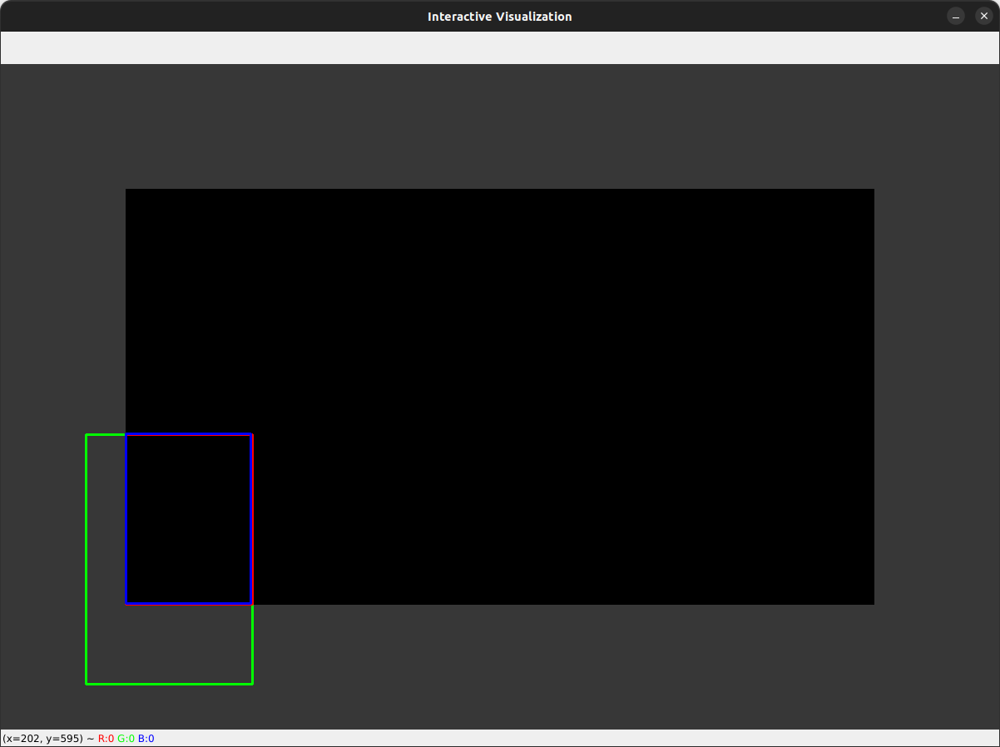

# Simple roi tracker


## Get started

```sh
# clone
git clone git@github.com:YoshiRi/Simple_ROI_Tracker.git

# install
cd simple_roi_tracker
poetry install

# start shell
poetry shell
python3 simple_roi_tracker/visualize.py 
```

## Interaction

- mouse
  - left click: generate ROI / Occlude the ROI
  - mouse over: move the ROI
- keyboard
  - `q`: quit
  - `r`: reset ROI size
  - `w`: increase ROI height
  - `s`: decrease ROI height
  - `d`: increase ROI width
  - `a`: decrease ROI width




## Description of the GUI outlook

- background
  - black: in side the image
  - gray: out side the image(to simulate occlusion by edge of the image)
- rois
  - green: ground truth
  - red: measurement in the image
  - blue: estimated by kalman filter